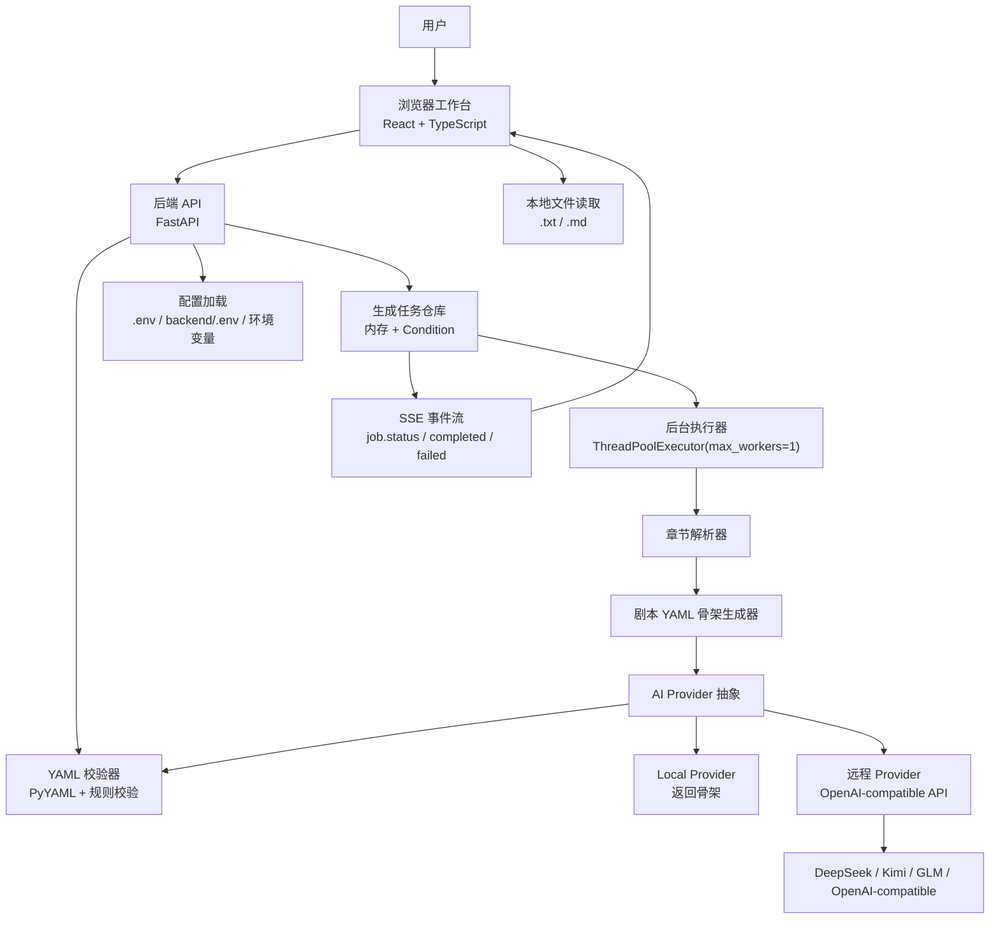
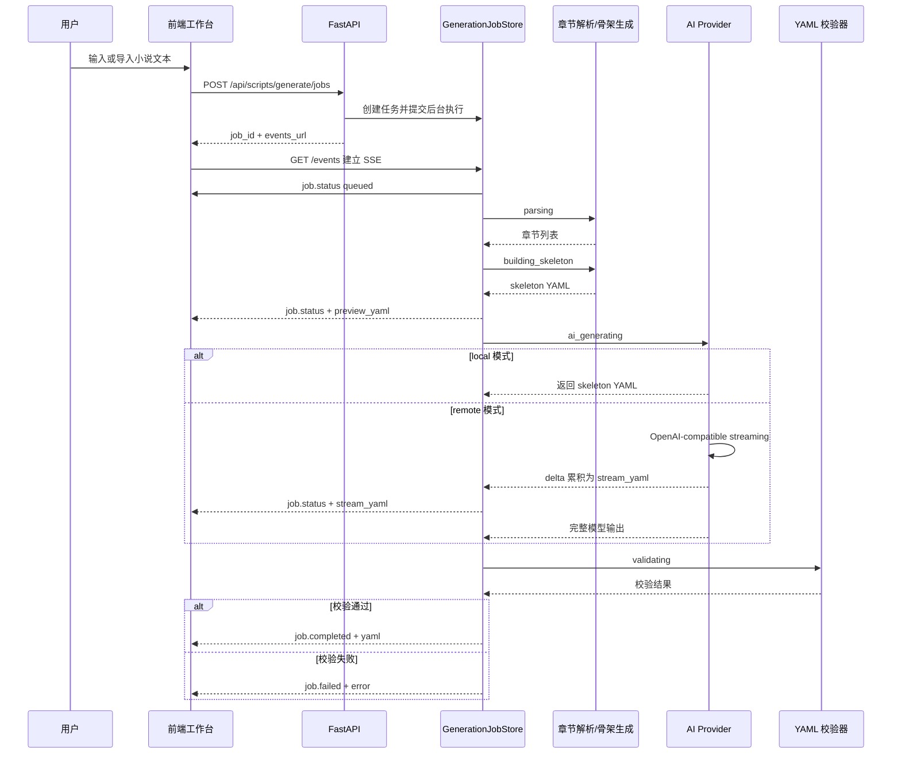
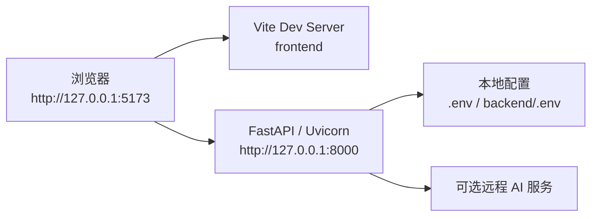

# 系统架构说明

## 1. 系统概述

AI Novel to Script 是一个面向小说作者和编剧的小说转剧本辅助工具。系统接收至少 3 个章节的小说文本，解析章节结构，生成符合 `0.1.0` 剧本 YAML Schema 的初稿，并支持结构化预览、局部编辑、YAML 校验、复制和下载。

当前系统以本地可演示和低运维复杂度为优先目标，采用前后端分离架构：

- 前端使用 React + TypeScript + Vite 构建浏览器工作台，负责输入、导入、模型选择、生成进度展示、YAML 编辑和结构化编辑。
- 后端使用 FastAPI 提供 HTTP API、后台生成任务、SSE 进度流、章节解析、AI Provider 调用和 YAML Schema 校验。
- 生成任务和结果暂存于后端进程内存中，不落库；用户导出的 YAML 由浏览器侧完成。
- 默认 `local` 模式不依赖外部 AI 服务，可稳定生成本地 YAML 骨架；配置远程密钥后可调用 OpenAI-compatible Chat Completions Provider 改写为更完整的剧本初稿。

## 2. 总体架构



系统按职责可拆为五层：

| 层次 | 主要模块 | 职责 |
| --- | --- | --- |
| 客户端层 | `frontend/src/App.tsx`、样式文件 | 小说输入、文件导入、模型选择、后台任务创建、SSE 监听、结构化预览与编辑、YAML 导出 |
| API 层 | `backend/app/main.py` | 暴露健康检查、AI 状态、模型列表、生成任务、SSE 和 YAML 校验接口 |
| 生成编排层 | `backend/app/generation_jobs.py`、`_generate_script_result` | 管理任务生命周期、阶段进度、事件广播、后台顺序执行和失败归一化 |
| 领域能力层 | `chapter_parser.py`、`script_draft.py`、`script_validator.py` | 章节识别、剧本骨架构建、Schema 规则校验 |
| 模型接入层 | `ai_provider.py`、`config_file.py` | 配置解析、Provider 选择、远程模型调用、流式输出清洗、失败修复请求 |

## 3. 运行时视图

### 3.1 前端工作台

前端是单页工作台，所有核心状态都保存在浏览器内存中。主要状态包括小说文本、标题、模型选项、当前生成任务、YAML 文本、结构化预览结果、校验结果和导出状态。

前端承担三类转换：

- 输入转换：将粘贴文本或本地 `.txt` / `.md` 文件读取为普通字符串，并根据文件名推导默认标题。
- 展示转换：把后端返回的 YAML 文本解析为可编辑的标题、logline、人物、场景、登场人物和 beats。
- 编辑回写：结构化编辑不会产生独立数据副本，而是直接更新同一份 YAML 文本，保证校验、复制、下载读取的都是最新内容。

生成过程采用“后台任务 + SSE”的交互方式。前端先调用任务创建接口，再连接事件流显示阶段进度；如果 SSE 断开，会回退调用任务详情接口拉取最终状态。

### 3.2 后端 API 服务

后端 FastAPI 应用负责统一入口与错误响应。启动时加载配置文件和环境变量，然后初始化一个全局 `GenerationJobStore(max_workers=1)`。

核心 API 如下：

| 方法 | 路径 | 说明 |
| --- | --- | --- |
| `GET` | `/api/health` | 健康检查 |
| `GET` | `/api/ai/status` | 当前默认 AI Provider 配置状态 |
| `GET` | `/api/ai/models` | 前端模型下拉选项，包含配置完整性 |
| `POST` | `/api/scripts/generate` | 同步生成 YAML，主要用于简单调用或测试 |
| `POST` | `/api/scripts/generate/jobs` | 创建后台生成任务 |
| `GET` | `/api/scripts/generate/jobs/{job_id}` | 查询任务快照 |
| `GET` | `/api/scripts/generate/jobs/{job_id}/events` | 监听任务 SSE 事件流 |
| `POST` | `/api/scripts/validate` | 校验当前 YAML 是否符合 Schema |

API 层将异常收敛为结构化错误，例如 `INVALID_INPUT`、`INVALID_CHAPTER_COUNT`、`AI_GENERATION_FAILED`、`YAML_VALIDATION_FAILED` 和 `JOB_NOT_FOUND`。

### 3.3 后台任务与事件流

生成任务由 `GenerationJobStore` 管理。每个任务包含：

- `job_id`：`job-` 前缀加 UUID。
- `status`：`queued`、`running`、`completed`、`failed`。
- `phase`：`queued`、`parsing`、`building_skeleton`、`ai_generating`、`validating`、`completed`、`failed`。
- `progress`、`message`、`progress_basis`：用于前端展示阶段进度。
- `preview_yaml`：本地骨架预览。
- `stream_yaml`：远程模型流式输出的可解析片段。
- `yaml`：最终规范化 YAML。
- `error`：失败码与失败消息。

任务状态通过 `Condition` 唤醒 SSE 连接。事件名称包括：

- `job.status`：阶段更新、骨架预览、流式输出更新。
- `job.completed`：最终 YAML 生成完成。
- `job.failed`：任务失败或任务不存在。
- heartbeat 注释：长时间无事件时保持连接活跃。

当前执行器设置为 `ThreadPoolExecutor(max_workers=1)`，因此生成任务按提交顺序执行。这降低了本地演示和远程模型调用的并发压力，也避免多个长文本生成同时占用资源。

## 4. 核心生成流程



流程要点：

1. 前端加载后获取健康状态、AI 状态和模型列表。
2. 用户输入小说文本并选择 `local` 或远程模型。
3. 后端先校验请求字段和模型 id，再创建后台任务。
4. 后台任务解析章节，要求至少 3 个有效章节，并支持中文章节、回、节、话、英文 `Chapter N`、Markdown 标题和简单编号标题。
5. 系统根据章节生成本地 YAML 骨架，保留 `source.chapters_count`、`source.chapter_titles` 和每个场景的 `source_chapter`。
6. 进入 AI 阶段时，骨架先作为 `preview_yaml` 返回给前端，使用户能在远程模型尚未完成时看到可用结构。
7. `local` 模式直接返回骨架；远程模式通过 OpenAI-compatible `/chat/completions` 发起 `stream: true` 请求。
8. 远程流式 delta 会被清洗为 `stream_yaml`，前端持续更新 YAML 面板，并在片段可解析时刷新结构化预览。
9. 远程模型完整输出后，后端提取真实 YAML、修正常见乱码、规范化 YAML，再执行 Schema 校验。
10. Provider 内部有一次修复机会：首轮远程 YAML 不合规时，会携带校验错误再次请求模型修复；仍不合规则任务失败。
11. 任务完成后，最终 YAML 替换流式内容，成为前端后续编辑、校验和导出的唯一数据源。

## 5. 数据模型与边界

### 5.1 剧本 YAML

当前剧本 Schema 版本为 `0.1.0`，顶层结构固定为：

```yaml
script:
  schema_version: "0.1.0"
  title: "剧本标题"
  logline: "一句话故事"
  source:
    type: "novel"
    chapters_count: 3
    chapter_titles:
      - "第 1 章 ..."
  characters:
    - id: "char-001"
      name: "人物名"
      role: "角色"
      description: "描述"
  scenes:
    - id: "scene-001"
      title: "场景标题"
      source_chapter: "第 1 章 ..."
      location: "地点"
      time: "时间"
      characters:
        - "人物名"
      beats:
        - type: "narration"
          text: "内容"
```

校验器保证以下约束：

- `script.schema_version` 必须等于 `0.1.0`。
- `source.type` 必须为 `novel`。
- `source.chapters_count` 必须不少于 3，且与 `chapter_titles` 数量一致。
- `characters` 必须是列表，人物必须包含字符串类型的 `id` 和 `name`。
- `scenes` 必须至少包含一个场景。
- 场景必须包含 `id`、`title`、`source_chapter`、`location`、`time`、`characters` 和 `beats`。
- beat 类型只能是 `action`、`dialogue`、`narration`、`transition`。
- `dialogue` 类型 beat 必须包含字符串类型的 `character`。

### 5.2 状态数据边界

当前版本不引入数据库，数据边界如下：

- 小说原文只在浏览器和本次生成请求中存在，后端不持久化。
- 本地导入文件只由浏览器读取文本内容，不上传文件对象或文件路径。
- 后台任务、事件历史和最终 YAML 只保存在后端进程内存，服务重启后丢失。
- API Key 只从 `.env`、`backend/.env`、`AI_CONFIG_FILE` 或系统环境变量读取，不进入接口请求体和响应体。
- 前端结构化编辑和 YAML 编辑共享同一份 YAML 文本，不维护独立草稿模型。

## 6. AI Provider 设计

AI Provider 采用抽象接口 `ScriptAIProvider`，当前有两类实现：

| Provider | 行为 | 适用场景 |
| --- | --- | --- |
| `LocalScriptAIProvider` | 直接返回本地 YAML 骨架，并通过回调推送骨架 | 无密钥、本地演示、基础流程验证 |
| `OpenAICompatibleScriptAIProvider` | 调用 OpenAI-compatible Chat Completions，支持 streaming、输出清洗、Schema 校验和一次修复 | DeepSeek、Kimi、GLM、OpenAI-compatible 模型 |

模型选项由环境变量决定。内置远程模型包括：

- `deepseek-v4-pro`
- `kimi-2.6`
- `glm-4.7-flashx`

配置状态接口只返回 provider、模型名、base URL、配置是否完整和缺失项，不返回密钥值。前端据此禁用未配置的远程模型。

远程模型的提示词策略强调：

- 返回 YAML only，不带 Markdown 解释。
- 保持英文 Schema key 和枚举值。
- 保留 source 可追溯字段。
- 将章节叙事改写为一章一场的可编辑剧本初稿。
- 人类可读字段根据输出语言配置生成，默认自动识别源语言。

## 7. 前端编辑架构

前端没有引入完整 YAML AST 编辑器，而是采用轻量规则对当前 YAML 文本做定点更新。这一选择符合当前 MVP 的低复杂度目标，但也决定了几个约束：

- 结构化编辑依赖当前 YAML 保持项目内约定的缩进和字段顺序。
- 手动 YAML 编辑后，结构化预览会重新解析；解析失败时仍保留原始 YAML 文本。
- 新增或删除人物、场景、beat 时，前端直接修改 YAML 行文本。
- 校验由后端 `/api/scripts/validate` 执行，前端只负责显示错误路径和消息。

这种设计优先保证“可见、可改、可导出”的创作闭环，后续如果要支持复杂重排、版本对比或协同编辑，可以再引入更正式的 YAML AST 或后端草稿模型。

## 8. 错误处理与降级策略

系统按边界分层处理错误：

- 输入层：空文本、无法识别章节、章节正文为空、章节数不足会返回明确错误。
- 模型层：不支持的模型 id、密钥缺失、远程 HTTP 错误、超时、无效 JSON 或空输出会归一为生成失败。
- YAML 层：语法错误、顶层结构错误、字段类型错误、beat 类型错误会返回路径化校验结果。
- 任务层：任务不存在时，SSE 返回 `job.failed`，查询接口返回 `JOB_NOT_FOUND`。
- 前端层：SSE 中断后回退到任务详情查询；远程生成过程中使用 `preview_yaml` 作为可视化兜底。

核心错误码：

| 错误码 | 含义 |
| --- | --- |
| `INVALID_INPUT` | 请求字段、小说文本、章节标题或输出格式不符合要求 |
| `INVALID_CHAPTER_COUNT` | 识别出的章节少于 3 章 |
| `AI_GENERATION_FAILED` | 模型配置、远程调用或 AI 输出修复失败 |
| `YAML_VALIDATION_FAILED` | YAML 语法或 Schema 校验失败 |
| `JOB_NOT_FOUND` | 后台生成任务不存在或已过期 |

## 9. 安全与配置

系统当前面向本地演示和受控环境部署，安全边界主要体现在配置隔离和接口最小暴露：

- CORS 仅允许本地前端开发端口，默认包含 `localhost:5173` 和 `127.0.0.1:5173`，可通过 `FRONTEND_PORT` 扩展。
- API Key 只从后端环境读取，前端不接触密钥。
- `.env.example` 提供配置模板，真实 `.env` 不应提交到仓库。
- 状态接口只暴露缺失配置项，不返回密钥内容。
- 当前无用户体系和权限模型，因此不适合直接开放为多用户公网服务。

## 10. 部署视图

本地开发和演示由两个进程组成：



常用启动方式：

- 前端：`cd frontend && npm run dev`
- 后端：`cd backend && .\.venv\Scripts\python main.py -p 8000 --reload`
- 一键演示：`.\scripts\start-local-demo.ps1`

当前仓库也包含 `docker-compose.yml`，但主要运行路径仍是本地 PowerShell 脚本和开发服务器。

## 11. 测试策略

系统测试按层覆盖：

- 后端单元测试：章节解析、配置加载、AI Provider、剧本骨架、YAML 校验。
- 后端 API 测试：健康检查、AI 状态、生成接口、后台任务、校验接口。
- 前端构建测试：TypeScript 与 Vite 构建。
- E2E 烟测：通过 Playwright 验证本地演示主流程，包括导入示例、生成 YAML、结构化编辑、校验和导出相关按钮。

建议在改动架构关键路径时至少运行：

```powershell
cd backend
.\.venv\Scripts\python -m pytest

cd ..\frontend
npm run build
```

涉及页面交互时再运行：

```powershell
.\scripts\start-local-demo.ps1 -RunSmoke
```

## 12. 关键设计原则

- 结构优先：先保证可校验、可编辑、可追溯的 YAML 结构，再增强文学风格。
- 本地可复现：默认 `local` 模式必须不依赖外部网络，保证演示与测试稳定。
- 长任务可见：生成过程必须持续展示阶段、进度、模型输出片段和最终状态。
- 配置不泄露：模型密钥只存在于后端环境，状态接口只返回配置完整性。
- 单一数据源：前端的结构化编辑、YAML 编辑、校验、复制和下载都基于同一份 YAML 文本。
- 渐进扩展：持久化、版本历史、协作、更多导出格式和更复杂的任务调度应作为独立演进方向加入。

## 13. 后续演进方向

后续架构扩展建议按风险从低到高推进：

1. 引入正式 JSON Schema 文件，减少手写校验规则和文档之间的漂移。
2. 将任务仓库替换为可持久化存储，支持后端重启后的任务恢复。
3. 增加项目、剧本版本、编辑历史和导出记录等持久化实体。
4. 将长文本生成拆为章节分块、并发生成、合并校验和断点续跑。
5. 将前端 YAML 定点字符串更新替换为 AST 级编辑，提高复杂编辑稳定性。
6. 增加更多导出格式，例如 Markdown、Word、Final Draft。
7. 接入 CI，自动运行后端测试、前端构建和 E2E 烟测。
8. 增加多用户认证、权限控制、任务限流和密钥托管后，再考虑公网服务化。
