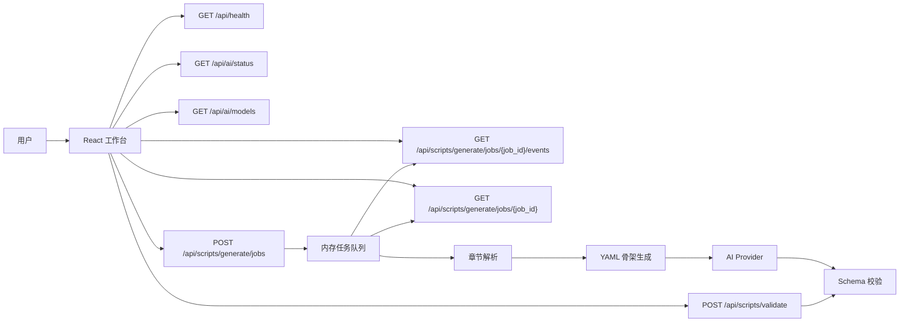

# 系统设计

## 总体架构

系统采用前后端分离架构。前端负责小说输入、模型选择、状态展示、YAML 展示、结构化预览和局部编辑；后端负责章节解析、AI Provider 配置解析、剧本 YAML 生成、远程模型调用和 Schema 校验。

## 前端模块

- 输入区：支持粘贴小说文本和导入本地 `.txt` / `.md` 文件。
- 状态区：展示后端连接状态、AI Provider 模式、模型名称、base URL 和缺失配置项。
- 模型选择：从 `/api/ai/models` 获取模型列表，并禁用缺少 API Key 的远程模型。
- 生成流程：创建后台生成任务，使用 SSE 展示阶段、百分比、模型和耗时，断线时回退查询任务状态。
- 结构化预览：把当前 YAML 映射为可编辑的标题、logline、人物、场景和 beats。
- YAML 面板：展示、在线编辑、校验、复制和下载当前 YAML。
- 同步提示：结构化编辑后立即写回同一份 YAML，并提示导出内容已更新。

## 后端模块

- API 层：提供健康检查、AI 状态、模型列表、同步生成、后台生成任务、SSE 进度流和校验 YAML 接口。
- 后台任务：使用内存存储任务状态，`ThreadPoolExecutor(max_workers=1)` 顺序执行生成，降低远程模型并发压力。
- 配置加载：启动时读取项目根目录 `.env`、`backend/.env`、`AI_CONFIG_FILE` 和系统环境变量。
- 章节解析：识别中文章节、回/节/话、英文 `Chapter N`、Markdown 标题和简单编号标题。
- 剧本骨架：把章节解析结果转换为符合 `0.1.0` Schema 的 YAML。
- AI Provider：默认 `local` 返回骨架；远程模型通过 OpenAI-compatible Chat Completions 调用。
- 输出清洗：提取 AI 回复中的真实 YAML，清理 Markdown 代码块、JSON 风格 YAML key 和常见乱码。
- Schema 校验：校验顶层结构、字段类型、章节数量、场景和 beat 类型。

## 处理流程

1. 前端加载后调用健康检查、AI 状态和模型列表接口。
2. 用户输入小说文本，并选择本地骨架或远程模型。
3. 前端调用 `POST /api/scripts/generate/jobs` 创建后台任务。
4. 前端通过 `GET /api/scripts/generate/jobs/{job_id}/events` 监听 `job.status`、`job.completed` 和 `job.failed` 事件。
5. 后端任务依次更新 `queued`、`parsing`、`building_skeleton`、`ai_generating`、`validating`、`completed` 或 `failed`。
6. 后端校验请求体和章节数量，并生成 YAML 骨架。
7. 如果使用 `local`，直接返回骨架；如果使用远程模型，则调用 Provider 改编骨架。
8. 远程 Provider 返回后，后端提取 YAML 并执行 Schema 校验。
9. 首轮远程输出未通过校验时，后端追加一次修复请求；仍失败则任务进入 `failed`。
10. SSE 断开时，前端回退调用 `GET /api/scripts/generate/jobs/{job_id}` 拉取最终状态。
11. 任务完成后，前端展示 YAML 和结构化预览。
12. 用户进行结构化编辑或 YAML 编辑后，校验、复制和下载都读取同一份最新 YAML。

## 数据边界

- 当前 MVP 不保存用户输入、生成结果或编辑历史。
- 后台生成任务只保存在进程内存中，后端重启后任务状态和结果会丢失。
- 本地文件导入只在浏览器中读取文本内容，不单独上传文件对象。
- API Key 只存在于后端运行环境或本地配置文件中，不进入请求体和接口响应。
- 生成结果以 YAML 文本返回，前端负责展示和导出。

## 错误处理

- 输入为空、章节不可识别或输出格式不支持时返回 `INVALID_INPUT`。
- 章节少于 3 个时返回 `INVALID_CHAPTER_COUNT`。
- 模型 id 不支持、远程 Provider 配置缺失、调用失败或输出无法通过校验时返回 `AI_GENERATION_FAILED`。
- YAML 语法或 Schema 不符合要求时返回 `YAML_VALIDATION_FAILED`，并携带错误路径。

## 设计原则

- 结构优先：先保证字段稳定，再逐步增强文学性和风格。
- 可编辑优先：输出是作者继续创作的初稿，不是最终定稿。
- 本地可演示：默认 local 模式必须稳定，不依赖外部网络。
- 配置不泄露：状态接口只返回缺失项，不返回密钥值。
- 长任务可见：长文本生成期间应持续展示阶段、百分比和最终结果。
- 渐进扩展：持久化、协作和导出格式通过独立 PR 分步加入。

## 后续扩展

- 保存项目和剧本版本历史。
- 基于后台任务框架增加章节分块生成、合并、缓存和断点续跑。
- 增加更正式的 JSON Schema 文件。
- 支持更多导出格式，例如 Markdown、Final Draft 或 Word。
- 将 E2E 烟测接入 CI。
- 完善远程模型输出质量评估和人工评分样本。
